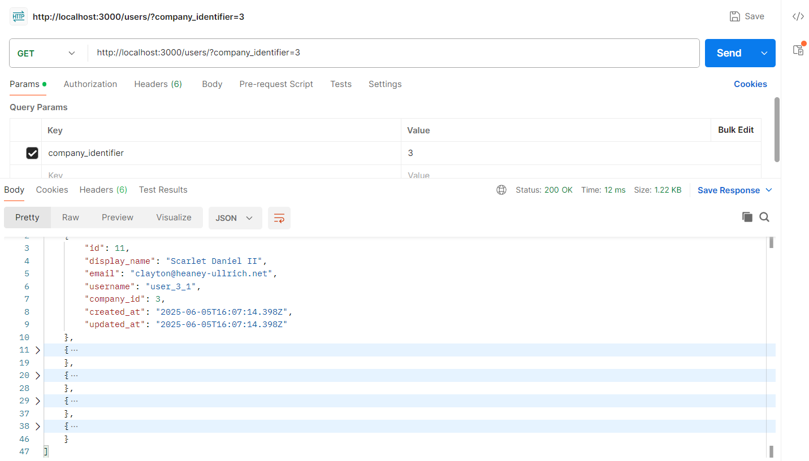
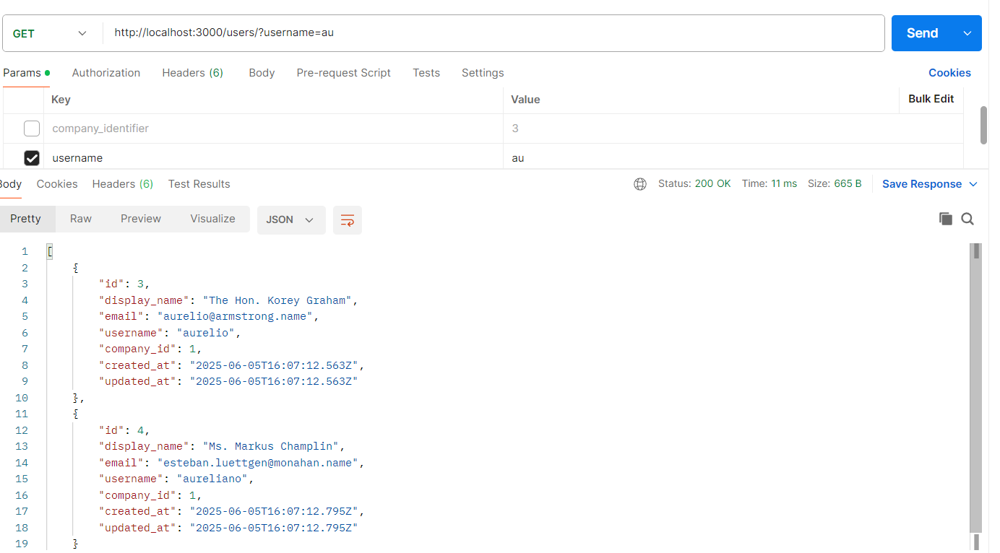
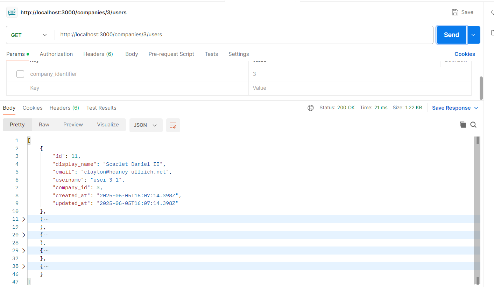

#### Ruby on Rails Code Challenge

Project Requirements:

- Ruby version: 2.7.6

#### Before the code challenge:

- Clone the repository locally and install all the dependencies
- Get familiar with the codebase
- Check the database schema

# MINHAS CONSIDERAÇÕES

1. Não há nenhum erro com o escopo de company. Consigo filtrar apenas a company que eu quero. Já havia visto isso de olhar o código, mas como dizia no enunciado para corrigir fui confirmar com a ferramenta Postman, fiz a requisição e não tive nenhum problema como descrito de vir todos os usuários.

2. Filtro de usuários não funciona direito pois tem falha de uso de SQL no escopo faltando os %%.
   
3. Depois que eu cheguei na parte do Teste que eu entendi o problema da questão 1, tem um problema de roteamento com a convenção do rails, vou arrumar.
   
4. Fiz mais testes de filtros
5. Cursor pagination
6. Mailer para novo usuário, sugestão colocar
   group :development do
   gem 'letter_opener'
   end
   no gemfile para simular envios abrindo página no navegador
7. Dockerfile e Docker-Compose
